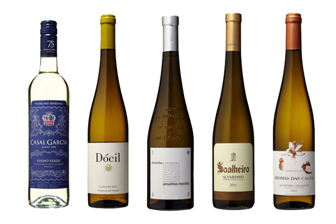

```{r echo=FALSE, message=FALSE, warning=FALSE, packages}
library(ggplot2)
```

```{r echo=FALSE, Load_the_Data}
white_wine <- read.csv("../wineQualityWhites.csv")
```

## **Introduction**
The data which will be analysed contains physicochemical sensory information of white wine of Vinho Verde. Vinde Verde, meaning "green wine", is produced in Minho area located at northwest Portugal. The word "green" indicates the wine's young age and not its color. The most important feature of the wine is its youth and freshness. And it should be consumed soon after bottling.

<a style='text-decoration: none;'>
  
  <div style='width: 500px; text-align: center;'> White Vinho Verde </div>
</a>

Vinho Verde could be white, red or rose. And the most productive kind of Vinho Verde is white. The dataset explored here contains 
```{r}
nrow(white_wine)
ncol(white_wine)
```

## **Univariate Analysis**
## **Bivariate Analysis**
## **Multivariate Analysis**
## **Final Plots and Summary**
## **Reflection**


